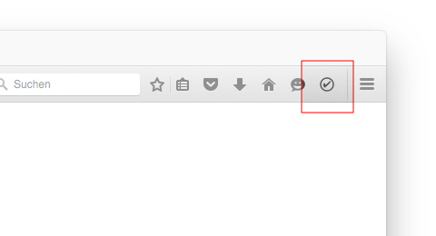

# firefox-2do-extension
A simple firefox extension creating a task for the current page.

## What it does

Clicking the icon will create a new Task in your 2Do inbox for the currently active tab. The title of the Tab will be used as the text of the task, the URL will be present in the note. So will any text you had selected on the current page.

## Troubleshooting

Make sure you allow firefox to open `twodo`-links with the 2Do app.

